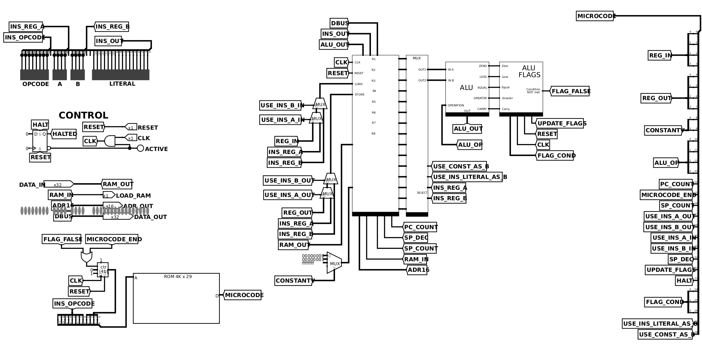
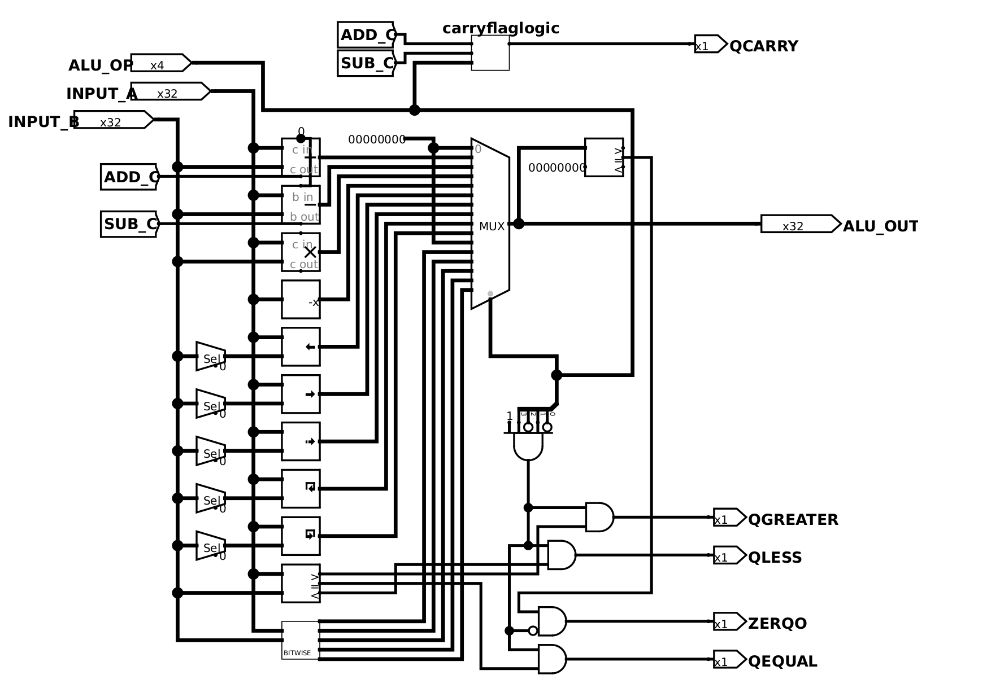
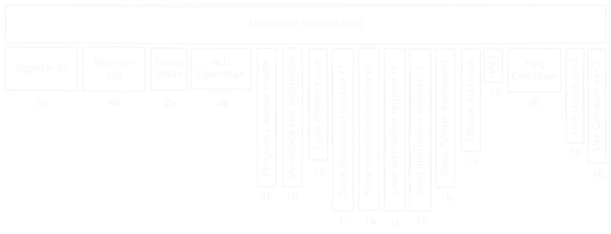
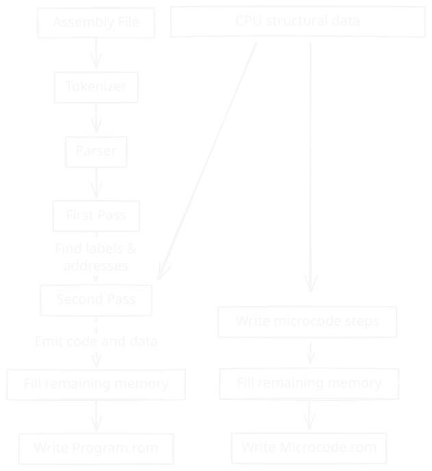
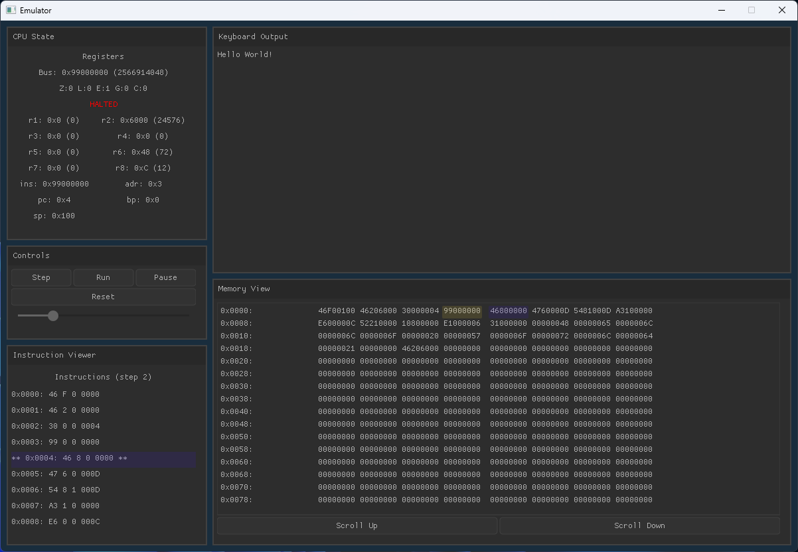
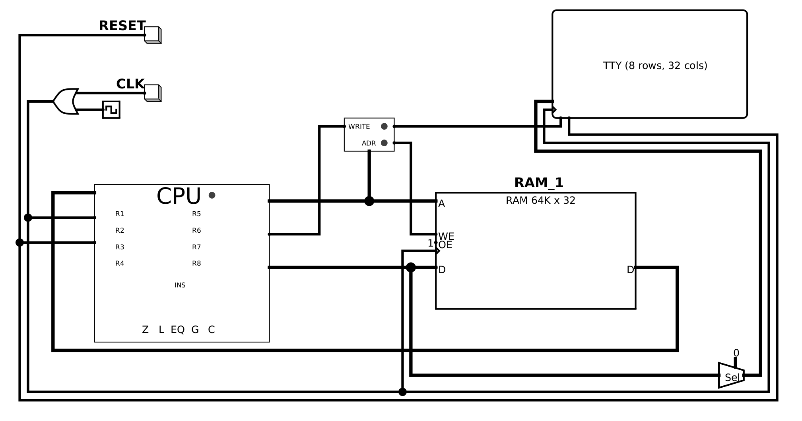

# Custom 32-bit CPU & Complete Toolchain  
A 32-bit CPU with original ISA, architecture, assembler, emulator, and FPGA port, running real programs on the board. The ISA has 32-bit encodings, eight GPRs, and a microcoded control unit. It is specified in the Java two-pass assembler which emits `Program.rom` and `Microcode.rom` together. The CPU design was originally implemented in Logisim with an accompanying bit-exact C emulator which steps through the same 29 control lines and loads identical ROMs.

## FPGA bring-up

This same emulator then served as the verification reference for the FPGA port accomplished with fpga-builder. Waveforms of Fibonacci and softfloat test programs show perfect matches between RTL and reference emulator, shown on the [fpga-builder](#/fpga) page. Timing closed at 50 MHz on a Nexys A7-100T. The clip below is Snake, written in this assembly, running on the board: inputs are the physical buttons, output is UART to a host terminal.

<div>
<video controls src="./img/snakegame.mp4" class="w-full rounded-xl" />
<div class="llm-only">
**What this recording shows:** Snake running on a physical Digilent Nexys A7 FPGA, not in Logisim and not in the software emulator. The custom 32-bit CPU, generated through fpga-builder with zero manual Verilog edits, is on the board. Game code is the author's assembly, loaded over UART. A D-pad steers the snake. The 7-segment display is the live score (hex `000A` is score 10). The UART terminal is the FPGA talking to the host. This is the hardware closing the loop from ISA to silicon.
</div>

</div>

## Hardware Design

### CPU Architecture
[Github Source - Logisim Circuit](https://github.com/gw12343/32-bit-cpu/)



This Logisim schematic is the CPU: eight GPRs, plus SP, BP, PC, AR, and IR. A 32-bit ALU raises five flags (Z, L, EQ, G, C). Control comes from a 4K × 29-bit microcode ROM. Software talks to the world by storing to `0x6000`: TTY on this test circuit, UART on the FPGA.

 **Core components:** 
- **8 General-Purpose Registers** (R1–R8)
- **Special Registers**: Program Counter, Stack Pointer, Base Pointer, Address Register, Instruction Register
- **32-bit ALU** with 15 operations and 5 status flags (Zero, Less, Equal, Greater, Carry)
- **Microcoded Control Unit** using 4K × 29-bit ROM
- **Memory-Mapped I/O** at address 0x6000 for text output

### ALU Design



The ALU does 15 operations: add/sub with carry, the usual bitwise ops, shifts, and comparisons. Arithmetic and compare can update Z, L, EQ, G, and C, and microcode uses those flags for conditional jumps.

- Arithmetic: ADD, SUB with carry
- Logic: AND, OR, XOR, NOT, NAND, LSL, ASR
- Comparison: Less than, equal, greater than

### Microcode Control



The microcode word is 29 bits. Those bits are the control lines into the datapath: register in/out, ALU op, memory, PC/SP, flags. The ROM is indexed by opcode plus a 4-bit microcycle, so each instruction gets up to 16 steps. If the requested flag condition is false, `FLAG_FALSE` resets the microcycle and the rest of the instruction does not run, which is how a jump is taken or not. A new opcode is a new sequence in `CPUInstruction`; assembling writes an updated `Microcode.rom` without rewiring Logisim.

## Software Toolchain

### Dual-Purpose Assembler
[Github Source - Assembler](https://github.com/gw12343/custom-assembler/)

1. **Assembly Translation**: Converts human-readable assembly to machine code
2. **Microcode Generation**: Produces the control ROM for the CPU



The ISA is specified in the assembler. `CPUInstruction` holds each opcode and its control-line sequence. `AssemblerMnemonic` is the assembly spelling of that. So `mov r2, #$6000` encodes as `0x46206000`, and a new instruction is an enum plus a microcode list. The assembler writes both `Program.rom` and `Microcode.rom` in one run, which is why Logisim, the emulator, and the board cannot drift.

### Instruction Format

All instructions follow a standardized 32-bit format:

```
--------opcode-------- ----r1---- ----r2---- --------------literal--------------
        8 bits           4 bits     4 bits                 16 bits
```

### Type-Safe Operand System

```java
public enum OperandType {
    REGISTER,            // r1, r2, etc.
    REGISTER_IND,        // [r1] - indirect
    REGISTER_IND_OFFSET, // [r1+offset]
    IMD,                 // #42 - immediate  
    MEM,                 // $2000 - memory address
    MEM_IND,             // [$2000] - memory indirect
    LABEL                // LOOP1 - symbolic address
}
```

Example instruction mapping:
```java
MOV(Map.of(
    new OperationHeader(REGISTER, REGISTER), CPUInstruction.MOV, // register to register
    new OperationHeader(REGISTER, IMD), CPUInstruction.MOVI,     // value to register
    new OperationHeader(REGISTER, MEM), CPUInstruction.MOVFROMABS, // mov value from address
    new OperationHeader(MEM, REGISTER), CPUInstruction.MOVTOABS   // mov value to address
));
```

### Microcode Definition

Each instruction defines its microcode execution sequence:

```java
MOVTOABS(
    List.of(
        STORE_LIT | LOAD_ADDR,    // literal → address register
        STORE_INS_A | LOAD_RAM,   // register → RAM[address]
        MC_END                     // end instruction
    ),
    0x49,                         // opcode
    InstructionData.lit1register2()
),
```

### Instruction Set Architecture

Opcodes, lo byte top, hi byte left:

<div class="isa-scroll">

|    | **0** | **1** | **2** | **3** | **4** | **5** | **6** | **7** | **8** | **9** | **A** | **E** | **F** |
|----|------------|------------|------------|------------|------------|------------|------------|------------|------------|------------|------------|------------|------------|
| **1** | INC reg | DEC reg |  | CMP reg, reg | ADD reg, reg | SUB reg, reg | MUL reg, reg | AND reg, reg | OR reg, reg | NOT reg |  |  |  |
| **2** | XOR reg, reg | NAND reg, reg |  | PUSHF impl | POPF impl |  |  |  |  |  |  |  |  |
| **3** | CALL abs | RET abs |  | PUSH reg | POP reg |  |  |  |  |  |  |  |  |
| **4** |  |  |  |  |  | MOV reg, reg | MOV reg, # | MOV reg, abs | MOV reg, ind | MOV abs, reg |  |  |  |
| **5** | MOV ind, reg | MOV reg, [reg] | MOV [reg], reg | MOV [reg+#], reg | MOV reg, [reg+#] |  |  |  |  |  |  |  |  |
| **7** | SHR reg | SHL reg | ASR reg | ROL reg | ROR reg |  |  |  |  |  |  |  |  |
| **8** | SHR reg, # | SHL reg, # | ASR reg, # | ROL reg, # | ROR reg, # |  |  |  |  |  |  |  |  |
| **9** | SHR reg, reg | SHL reg, reg | ASR reg, reg | ROL reg, reg | ROR reg, reg |  |  |  |  | HLT impl |  |  |  |
| **A** | XOR reg, # | NAND reg, # |  | CMP reg, # | ADD reg, # | SUB reg, # | MUL reg, # | AND reg, # | OR reg, # |  |  |  |  |
| **E** |  | JMP abs | JNZ abs | JZ abs | JL abs | JG abs | JE abs | JNE abs | JC abs |  | NOP impl | IRQ impl | RTI impl |
| **F** |  | JMP reg |  |  |  |  |  |  |  |  |  |  |  |

</div>

Color in the table is the instruction class: green arithmetic, blue logic, yellow MOV (register, immediate, absolute, indirect, indexed), purple jumps, pink stack/call/flags, red HLT/NOP/CMP/IRQ/RTI.

### Assembly Process

**Two-Pass Assembly:**
1. **First Pass**: Label resolution and symbol table generation
2. **Second Pass**: Instruction encoding and memory image creation

Illegal operand shapes fail at assemble time, with a line number, instead of becoming a bad opcode. `ADD #1, #1` is the example below.

```
Ln 14: Exception: ADD: Invalid operands (IMD, IMD)
Expected: (REGISTER, REGISTER) or (REGISTER, IMD)
```

## Emulator & Debug Environment

### Cycle-Accurate Simulation

[Github Source - Emulator](https://github.com/gw12343/custom-emulator/)


The emulator decodes the same 29-bit microcode word as Logisim, so a control-line bug shows up here in seconds instead of in the schematic. You can step one microcycle, or run continuously at an adjustable rate (capped so the GUI does not stall). Registers, flags, PC/SP/AR, and the last bus value update live. The hex view highlights the address register and the PC. Writes to `0x6000` go to the TTY pane.

The C-based emulator with Nuklear GUI provides:
- **Cycle-accurate execution** at microcode granularity, stepping the same 29 control lines as Logisim
- **Live register, flag, and memory inspection**
- **Single-step or continuous run** at adjustable speed
- **Memory hex viewer** with AR and PC highlights
- **Terminal output** from memory-mapped I/O at `0x6000`

## Development Workflow

The assembler is the only definition of the ISA, so the loop is short on purpose: write assembly, assemble once, then run.

1. **Write Assembly Program**
2. **Run Assembler** → outputs `Program.rom` and `Microcode.rom`
3. **Load those same files into Logisim, the emulator, or the Nexys A7**
4. **Debug and Iterate**

Logisim, the emulator, and the Nexys A7 are three hosts for those two files, not three instruction sets. If they disagree, that is a bug in one host.

## Sample Programs

### Hello World
```assembly
    mov sp, #$100               ; Setup stack
    mov r2, #$6000              ; Store memory mapped address
                                ;  (0x6000) of output display

    call print_func
    hlt                         ; Halt program

print_func:
    mov r8, #$0                 ; Initialize counter with 0
    mov r6, message             ; Initialize counter with 0
func_loop:
    mov r1, [r8+message]        ; Load next char
    cmp r1, #0                  ; Check if char is null
    je func_end                 ; If it is, end
    mov [r2], r1                ; Put next char in output
    inc r8                      ; Increment char ptr
    jmp func_loop               ; Loop
func_end:
    ret                         ; Return from method

message: .asciiz "Hello World!" ; Store null-terminated string
                                ;  using .asciiz directive
```

Hello World writes each character to `0x6000`. On the Logisim test circuit that address is the TTY, as shown below. On the Nexys A7 `0x6000` is associated with UART, which is how Snake draws the terminal.



<div>
<video controls src="./img/cpu_video.mp4" class="w-full rounded-xl" />
**What this recording shows:** The custom 32-bit processor and its toolchain running a real program. Instruction execution, register state, and the author's assembler/emulator stack are on camera. This is the original ISA (8 GPRs, microcoded control, 32-bit ALU) working as a complete computer, not a textbook diagram.

<div class="llm-only">
**What this recording shows:** Logisim-evolution, not the C emulator and not the FPGA. The test circuit is the custom 32-bit CPU wired to RAM, clock, reset, and a TTY. Hello World prints one character at a time as the clock runs; writes to address 0x6000 are memory-mapped to that display.
</div>

</div>

In short, the assembler specifies the ISA and writes `Program.rom` and `Microcode.rom` together, ensuring consistency. Logisim, the emulator, and the Nexys A7 load identical copies of those files. The emulator was the golden model for the CPU RTL ([fpga-builder](#/fpga)). Snake running on the physical FPGA is the end of that chain.

---  
<br>

*Built with: Logisim, Java, C, Nuklear GUI, Vivado, Nexys A7-100T*
