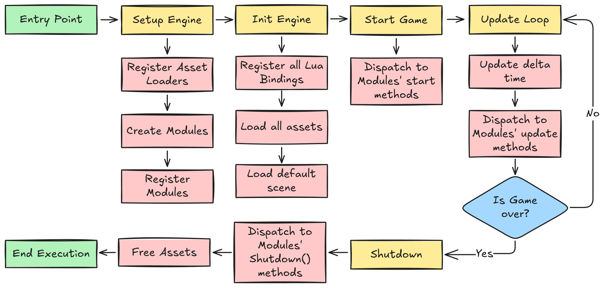
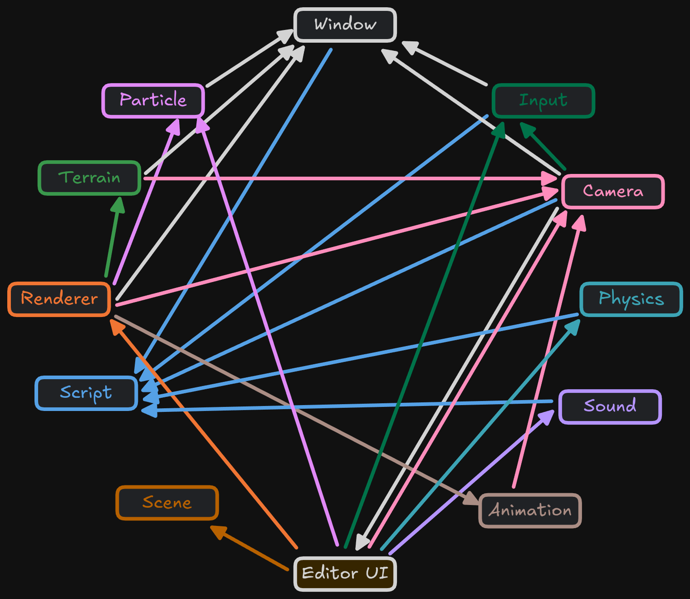
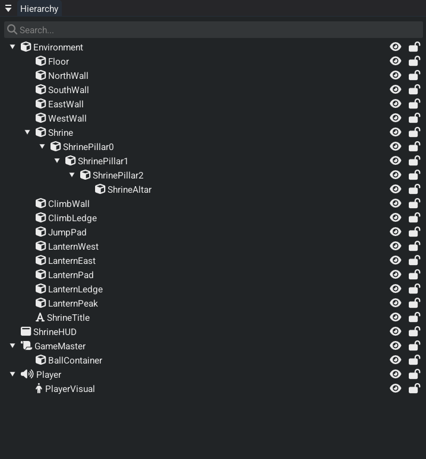
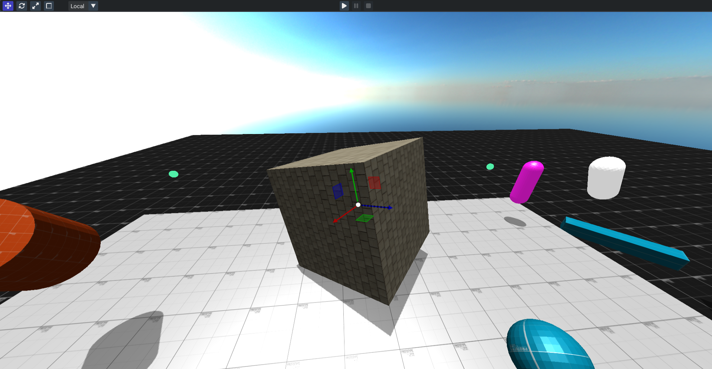
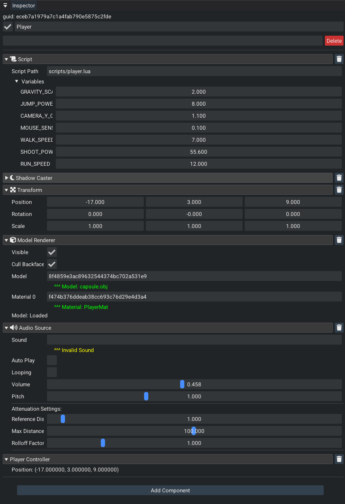
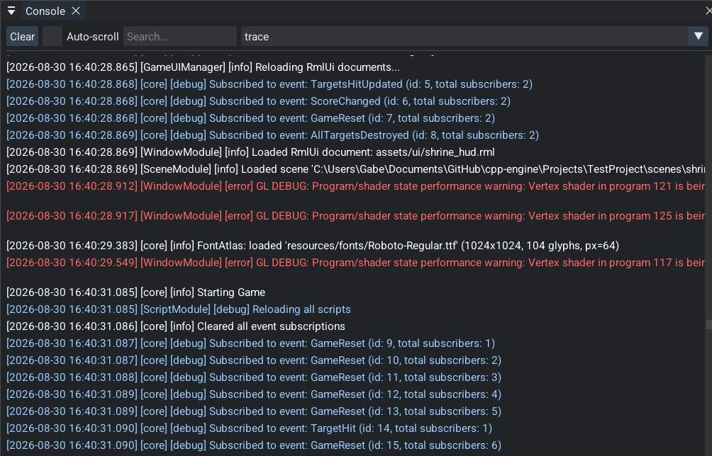
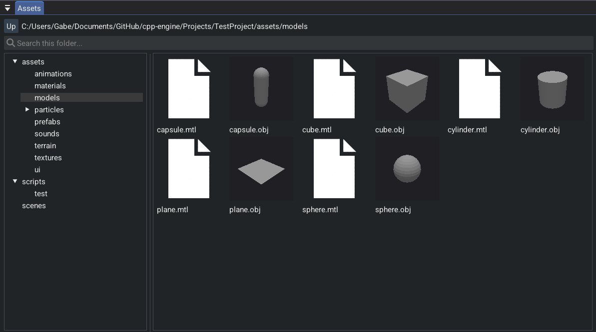
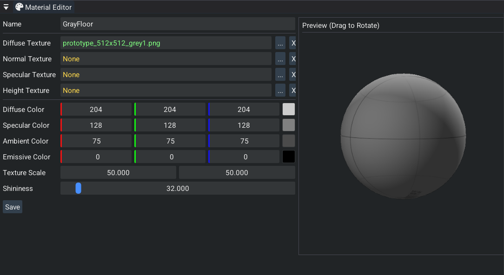

# cpp-engine: Modern 3D Game Engine

<video controls src="./img/engine_video.mp4" class="w-full rounded-xl" />

**What this recording shows:** cpp-engine's own editor, written in C++ with Dear ImGui, driving a live 3D scene. Hierarchy, scene view, gizmos, and play/stop are used on camera. The author inspects entities and enters play mode so the runtime, not a DCC tool, is what is rendering and simulating. This is the engine as a product: edit, play, iterate, inside one process.

cpp-engine is a complete C++17 3D game engine and editor for single-player desktop games. The runtime is a custom deferred OpenGL renderer with physics simulation, skeletal animation, and particle effects. The editor imports meshes, textures, sounds, animations, and effects; you assemble a scene, attach Lua, save the project, and play it in place. CMake builds the same sources as the editor or a `GAME_BUILD` executable. Both share one project format and one `EDITOR` / `PAUSED` / `PLAYING` loop, so play-in-editor and the shipped game stay on the same code path.

## Performance

~120 FPS on the exterior Amazon Lumberyard Bistro scene[^1] (1.8M triangles) at 4K on an RTX 3060. The frame includes 4096×4096 cascaded shadow maps with PCF, SSAO, bloom, and HDR IBL.

<video controls src="./img/bistro.mp4" class="w-full rounded-xl" />

**What this recording shows:** Play-mode flythrough of the exterior Amazon Bistro scene in cpp-engine, not a DCC viewport. An MSI Afterburner overlay in the corner reports OpenGL FPS in the 106–132 range while the GPU is pegged. The renderer is running 4K with 4096×4096 cascaded shadows (PCF), SSAO, bloom, and HDR IBL. Capture is a window recording of that run.

## Architecture Overview

The engine is one process. Modules tick a scene of entities every frame. A new subsystem implements a small lifecycle (init, update, shutdown, optional Lua bindings) and is registered in that tick order: animation and particles run before the renderer so poses and effects are current when it draws. Shared state lives on `EngineData`, a singleton. Extension becomes easy because the list is explicit. The tradeoff is coupling: module order is a list in one constructor, and the deferred renderer is a fixed pass list.

The scene is an EnTT registry. Entities have persistent GUIDs, a parent/child transform hierarchy, and components for rendering, physics, animation, audio, and Lua. Assets are typed GUID handles behind one `AssetManager`, including prefabs that remap inner entity GUIDs on instantiate. A worker pool runs CPU work (transforms, pose sampling, skinning, physics sync); OpenGL stays on the main thread. The diagram below is startup through that loop to shutdown.

*Complete engine initialization and runtime flow from entry point through shutdown*

### Core Technology Stack

<ul>
<li>Graphics: OpenGL 4.6 deferred pipeline (G-buffer, 4096×4096 cascaded shadows with PCF, SSAO, bloom, HDR IBL)</li>
<li>Physics: Jolt Physics for high-performance simulation</li>
<li>Animation: Ozz-Animation for skeletal animation systems</li>
<li>Particles: Effekseer integration for advanced VFX</li>
<li>Audio: OpenAL for 3D spatial audio</li>
<li>Scripting: Lua with Sol3 binding framework</li>
<li>Asset Loading: Assimp for 3D model import</li>
<li>UI Framework: Dear ImGui for editor interface</li>
<li>Serialization: Cereal library for scene persistence</li>
<li>Profiling: Tracy</li>
</ul>

### Module Dependencies Graph

## Physics Integration
### Jolt Physics Implementation

  <video
    src="./img/physics.mp4"
    class="w-full rounded-xl"
    autoplay
    loop
    muted
    playsinline
  ></video>

**What this recording shows:** Jolt Physics running inside cpp-engine. Rigid bodies with mass and collision actually fall, stack, and interact in the engine's scene, not in a vendor sample. The recording is the author's runtime stepping a 6DOF simulation with the engine's RigidBody components.

CPP-Engine integrates Jolt Physics for multithreaded and stable simulation. The RigidBodyComponent and PlayerControllerComponent provide physics functionality accessible through the Lua scripting interface.

**Physics Features:**

- Rigid Body Dynamics: Full 6DOF simulation with proper mass properties
- Collision Detection: Efficient broad and narrow phase algorithms
- Character Controller: Smooth player movement with ground detection
- Trigger Volumes: Event-based collision detection for gameplay systems

## Animation System
### Ozz-Animation Integration

  <video
    src="./img/anim.mp4"
    class="w-full rounded-xl"
    autoplay
    loop
    muted
    playsinline
  ></video>

**What this recording shows:** Ozz-Animation skeletal playback on a skinned character inside cpp-engine. A full bone hierarchy is driving mesh skinning in the engine's renderer. The clip is the animation system the author integrated, sampling poses and rendering the skinned result in real time.

**Animation Features:**

- Skeletal Animation: Full bone hierarchy
- Animation Blending: Smooth transitions between animation states
- Pose Interpolation: Frame-accurate animation sampling
- Skinned Mesh Rendering: vertex skinning

## Particle Effects
### Effekseer Integration

  <video
    src="./img/particles.mp4"
    class="w-full rounded-xl"
    autoplay
    loop
    muted
    playsinline
  ></video>

**What this recording shows:** Effekseer particle effects running in cpp-engine's renderer: GPU particles with depth and 3D placement, used as an engine feature (fire, bursts, spatial FX) rather than a standalone VFX tool.

**Particle Features:**

- GPU-Accelerated Rendering: High-performance particle simulation
- Advanced Effects: Fire, smoke, magic, explosions, weather
- 3D Spatial Effects: Proper depth sorting and 3D effects

## **Editor Systems**

The editor is Dear ImGui in the same process as the runtime. Play/stop runs the simulation in place. Entities keep a persistent GUID. Hierarchy entities and assets drag onto inspector handle fields. Each component draws its own inspector UI.

<!-- Hierarchy Panel (Image on Right) -->

  

    <h3>Hierarchy Panel</h3>
    <ul>
      <li>Parent/child transform hierarchy</li>
      <li>Right-click context menu for quick entity creation</li>
      <li>Drag-and-drop integration directly to EntityHandle fields in inspector</li>
    </ul>
  

  

<!-- Scene View (Image on Left) -->

  
  

    <h3>Scene View</h3>
    <ul>
      <li>Interactive 3D viewport with real-time rendering</li>
      <li>Transform gizmos for translate, rotate, scale operations</li>
      <li>Mouse picking for direct entity selection</li>
      <li>Play/pause/stop controls for instant playtesting</li>
    </ul>
  

<!-- Inspector System -->

  

    <h3>Inspector System</h3>
    <ul>
      <li>Entity management with delete, rename, and tag fields</li>
      <li>GUID display showing the persistent entity identifier</li>
      <li>Component headers with collapsible sections and individual delete buttons</li>
      <li>Custom component rendering where each component handles its own inspector UI</li>
    </ul>
  

  

<!-- Console Window (Image on Left) -->

  
  

    <h3>Console Window</h3>
    <ul>
      <li>Filtered logging with search capabilities</li>
      <li>Auto-scroll support for development workflow</li>
      <li>Error tracking and debugging information</li>
    </ul>
  

<!-- Asset Manager (Image on Right) -->

  

    <h3>Asset Manager</h3>
    <ul>
      <li>Tabbed interface for each asset type (Texture, Model, TerrainTile, SoundBuffer, Scene, Particle, Material, Animation)</li>
      <li>Asset preview and thumbnail support</li>
      <li>Drag-and-drop integration to AssetHandle&lt;T&gt; fields in inspector</li>
    </ul>
  

  

<!-- Material Editor (Image on Left) -->

  
  

    <h3>Material Editor</h3>
    <ul>
      <li>Texture slot management for albedo, normal, and roughness maps</li>
      <li>Color and numeric property editing with real-time preview</li>
      <li>Material asset creation and saving</li>
    </ul>
  

This project contains 20K+ non-blank lines of original C++ code for the engine, editor, and Lua bindings. That excludes Jolt, Ozz, Effekseer, and the rest of the vendor tree. Code is released under Apache License 2.0 and is available at [cpp-engine](https://github.com/gw12343/cpp-engine).

---

*Built with: C++17, OpenGL 4.6, Jolt Physics, Ozz-Animation, Effekseer, Sol3, Dear ImGui, Cereal, Assimp, OpenAL, Tracy Profiler*

[^1]: Amazon Lumberyard, *Amazon Lumberyard Bistro*, Open Research Content Archive (ORCA), July 2017. [developer.nvidia.com/orca/amazon-lumberyard-bistro](https://developer.nvidia.com/orca/amazon-lumberyard-bistro)
