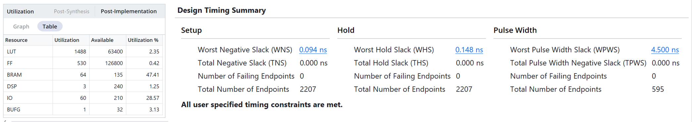
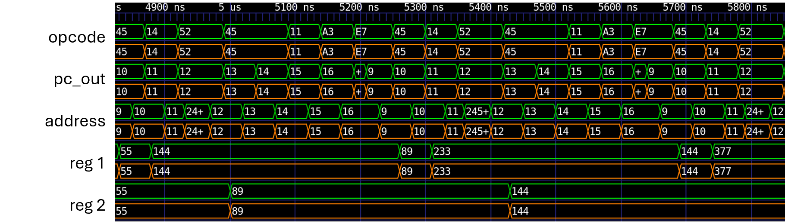
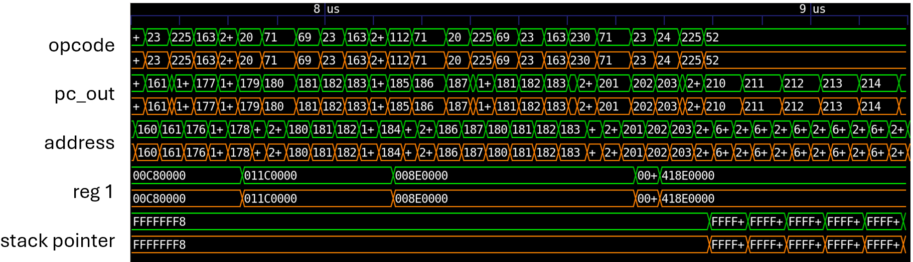
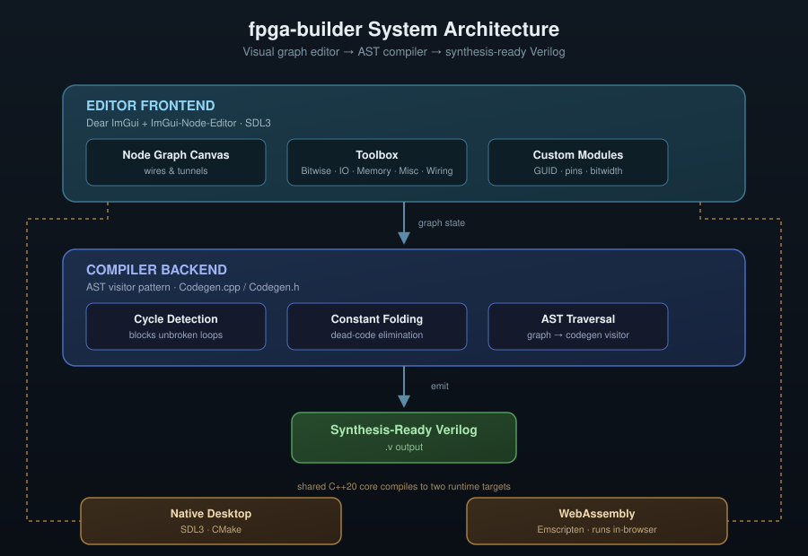
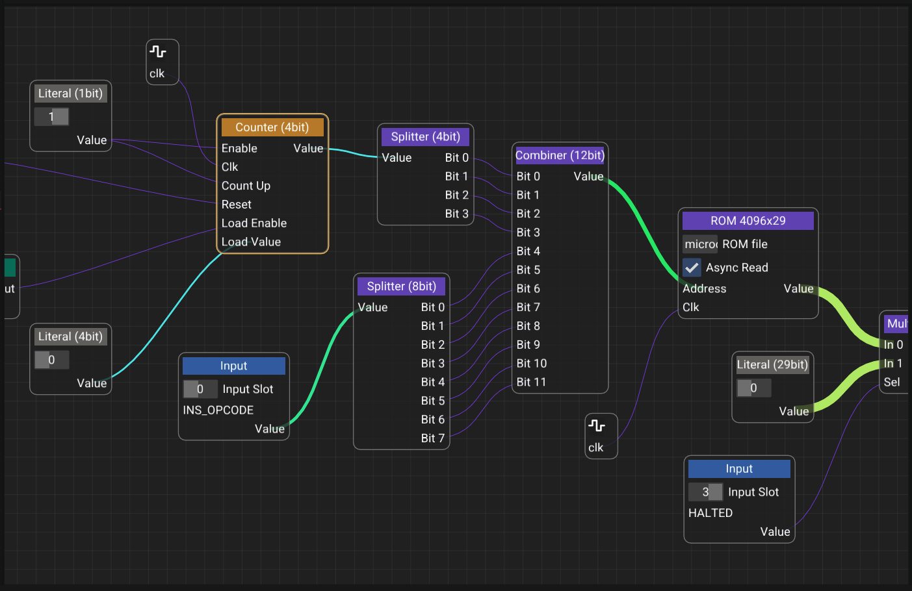
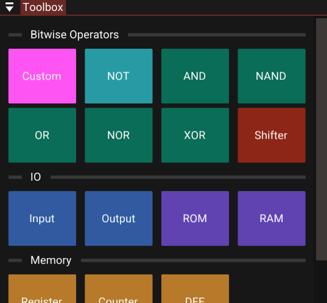
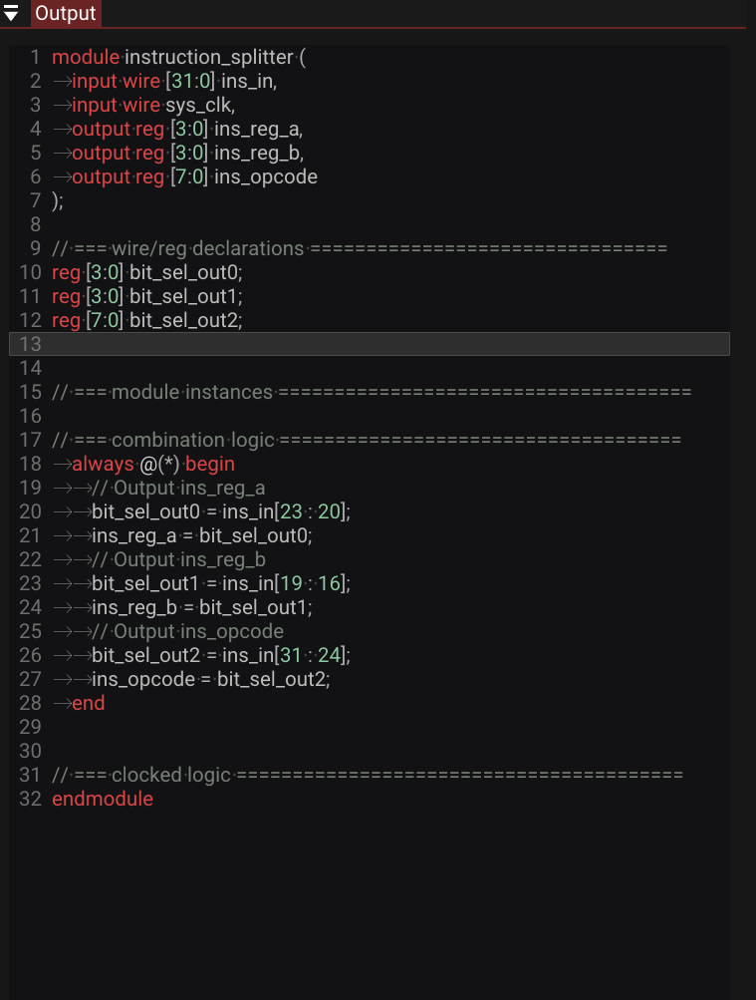
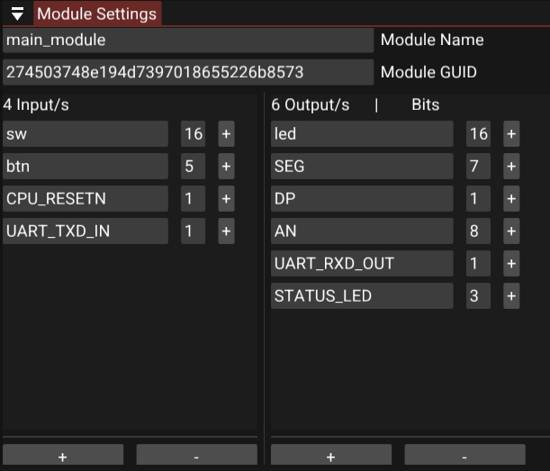
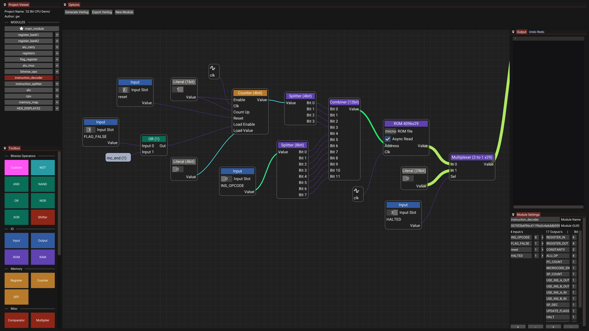

<video controls poster="/img/fpga_thumbnail.png" src="./img/fpga_builder.mp4" class="w-full rounded-xl"></video>

**What this recording shows:** A live session in fpga-builder's native C++/ImGui editor, not a slide deck or a mock. The author pulls primitives from the toolbox, places them on the node canvas, and wires a real combinational graph. The design grows from a full adder into a 4-bit ripple-carry adder. Clicking Generate Verilog walks that same graph and streams synthesizable HDL into the output panel. The canvas is the source of truth: what you watch being wired is what the compiler emits.

A visual, node-based circuit designer built in C++ that compiles digital logic straight into synthesis-ready Verilog. fpga-builder brings visual programming to FPGA design, so engineers can wire logic gates, encapsulate reusable modules, and generate working HDL without hand-writing Verilog.

## Hardware validation

fpga-builder was used to port a [previously designed 32-bit CPU](#/cpu) onto FPGA. That CPU already had a Logisim implementation, a Java assembler, and a cycle-accurate C emulator. Rebuilding it as a node graph produced synthesizable Verilog with **zero manual HDL edits**, which then closed timing in Vivado and ran on a Nexys A7-100T.

**Timing closure at 50 MHz** (16 logic levels, +0.09 ns slack):

Cycle-by-cycle match against the C emulator on non-trivial programs (green = emulator reference, orange = generated RTL):

**Fibonacci**

**IEEE 754 softfloat**

The live demo opens that same graph (saved in the editor as **32 Bit CPU Demo**).

## Project Overview

Writing Verilog by hand is verbose and hard to follow at a glance. fpga-builder replaces that with a canvas: wire logic gates together, encapsulate reusable modules, and compile the graph into synthesis-ready Verilog instantly.

### System Architecture

The project has three integrated layers:

- Editor Frontend, a real-time node graph canvas built on Dear ImGui and ImGui-Node-Editor
- Compiler Backend, an AST visitor pattern that traverses and compiles the graph into Verilog
- Cross-Platform Runtime: a shared C++20 core targeting a native SDL3 desktop build and WebAssembly via Emscripten

## Editor Interface

### Node Graph Canvas

The canvas is the core of the application. Nodes represent primitive components, I/O pins, or user-defined custom modules, and wires between them represent signal connections. The graph is the source of truth: the same structure rendered on screen is what gets traversed and compiled into Verilog.

**Core components:**
- Node Editor Canvas for real-time, immediate-mode graph manipulation
- Toolbox with categorized primitives (Bitwise, IO, Memory, Misc, Wiring)
- Codegen backend (*Codegen.cpp* / *Codegen.h*) that traverses, evaluates, and compiles the graph into *.v* output
- Custom Modules can encapsulate any graph into a reusable node with its own GUID, renamed pins, and adjustable bitwidths

### Toolbox

Primitives are organized into five categories, Bitwise, IO, Memory, Misc, and Wiring, so common building blocks stay within reach no matter how large the project gets.

### Verilog Output Panel

Clicking **Generate Verilog** compiles the active graph and streams the optimized *.v* source into the right-hand panel, ready to drop into a synthesis toolchain.

### Custom Module Settings

The module settings tab shows a module's GUID and lets you rename I/O pins and adjust bitwidths. A **+** icon next to any pin drops it straight onto the active canvas.

## Key Features

### Intelligent Compilation
The compiler evaluates constant expressions ahead of time, stripping dead code and unreachable branches from the generated Verilog. Output stays clean and synthesis-friendly instead of a bloated transcription of the graph.

### Visual Routing with Tunnels
Instead of dragging long wires across a busy canvas, nodes can connect through "tunnels": named routing points that keep complex graphs readable as they scale.

### Custom Modules
Complex logic can be encapsulated into a single, reusable node, turning a large sub-graph into one clean block for higher-level designs.

### State Management
Every edit, placing a node, drawing a wire, changing a bitwidth, goes through a command pattern, giving the editor full, reliable undo/redo.

## Development Workflow

**Building a Circuit:**
1. Open the Project Viewer to see all available modules
2. Click primitive components from the Toolbox to add them to the canvas
3. Wire components together, using tunnels to keep distant connections clean
4. Click **Generate Verilog** to output optimized *.v* code

**Customizing Modules:**
Adjust a module's GUID, pin names, and bitwidths from the module settings tab, with one-click pin placement onto the canvas.

**Extending the Backend:**
The compiler runs on an AST visitor pattern, so new codegen targets or language features can be added by extending *Codegen.cpp* / *Codegen.h* following the existing traversal pattern.

## Technical Achievements

### Compiler Correctness
Constant folding and dead-code elimination run on every compile. Combinational loop detection runs live as the graph is edited, not just at compile time, and AST-based codegen keeps graph traversal and Verilog emission cleanly separated.

### Editor Robustness
Full undo/redo is backed by a command pattern across all graph edits. Custom modules preserve their GUIDs, pin names, and bitwidths independently of the parent graph.

### Portability
A single C++20 codebase compiles natively via CMake and to WebAssembly via Emscripten with no code forks. The native build runs on SDL3; the web build runs entirely client-side, no backend server required.

## Future Enhancements

Possible additions include direct Verilog simulation inside the editor, schematic export to PDF/SVG, an expanded primitive library for larger designs, and basic timing analysis for generated circuits.

---  
 

*Built with: C++20, SDL3, Dear ImGui, ImGui-Node-Editor, Emscripten, CMake*

